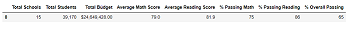
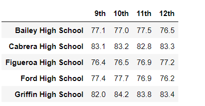
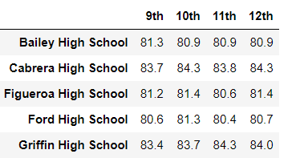
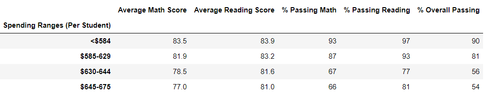
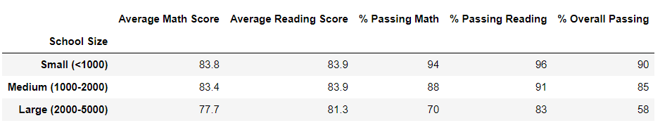
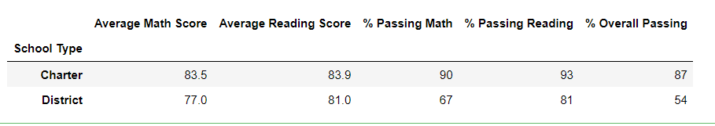

# School_District_Analysis

## Overview of the school district analysis: 
Due to academic dishonesty, subjects for reading and math grades have been altered for ninth grade in Thomas High School. 
For this reason, the school board want to upload the state-testing standards and asked the data scientist; Maria to replace 
the math and reading scores for Thomas High School with NANs while keeping the rest of the data intact.

## Purpose
To conduct analysis on Thomas High School data and access if the changes for grade ninth affect the overall analysis. 
To provide report to the school board for making decision regarding school budget and funding. 

## Results 

### 1. How is district summary affected?

Below is the comparison between summary for all students and after removing ninth grade from Thomas High School. 
Total students, schools numbers and average reading scores were not affected. However, the overall passing percentage 
was reduced from 65.2% to 64.9%, similarly average math score decreases from 79.0 to 78.9, percentage of students passing 
math decreases from 75.0 to 74.8 and slightly decrease passing reading from 85.8% to 85.7%. 

#### District summary for all students.

### 2. How is the school summary affected 

The overall passing for Thomas High School was dropped from 91.0 to 65.0 after removing ninth graders. But the total number of students didn't change for all analysis. 
### 3. How does replacing the ninth graders' math and reading scores affect Thomas High School's   performance relative to the other schools?
With the original data Thomas High School was the top 5 schools in the district with overall passing percentage of 90.9. However, after removing ninth graders Thomas High School drops out of the Top 5 and ranked number 8 with overall passing percentage of 65. 

### 4.How does replacing the ninth-grade scores affect math and reading scores by grade
Removing ninth graders from Thomas High School didn't affect scores by grades for math and reading as shown below. The student count for Thomas High School was 1174.

Math scores by grade  
                                                             

Reading scores by grade  
  
 
#### 4.1 Scores by school spending. 
The table below shows that the average math and reading were the same, however in bin $630-644 the percentage of students passing math, reading and the overall passing were dropped by around 7 points. 
 

#### 4.2 Scores by school size 
Thomas High School was categorized in Medium School Size and the grades per school size was affected and decreased by around 6 points on passing math, reading, and overall passing as shown below. 
 

#### 4.3 Scores by school type 
District schools was not affected after removing ninth grade from Thomas High School, however in Charter Schools the percentage of passing math, reading and overall passing were dropped by around 4 points. 
 

### 5. Summary: 
Summarize four changes in the updated school district analysis after reading and math scores for the ninth grade at Thomas High School have been replaced with NaNs.
Removing the ninth graders from Thomas High School the school district affected in the following ways: - 
- Average math scores decreased slightly by 1%
- Percentage of students passing math dropped slightly (-1%)
- Percentage of students passing reading dropped slightly (0.1%)
- The overall passing rate dropped by 0.3%. 
- Thomas High School dropped out of the top 5 high school’s rank 
